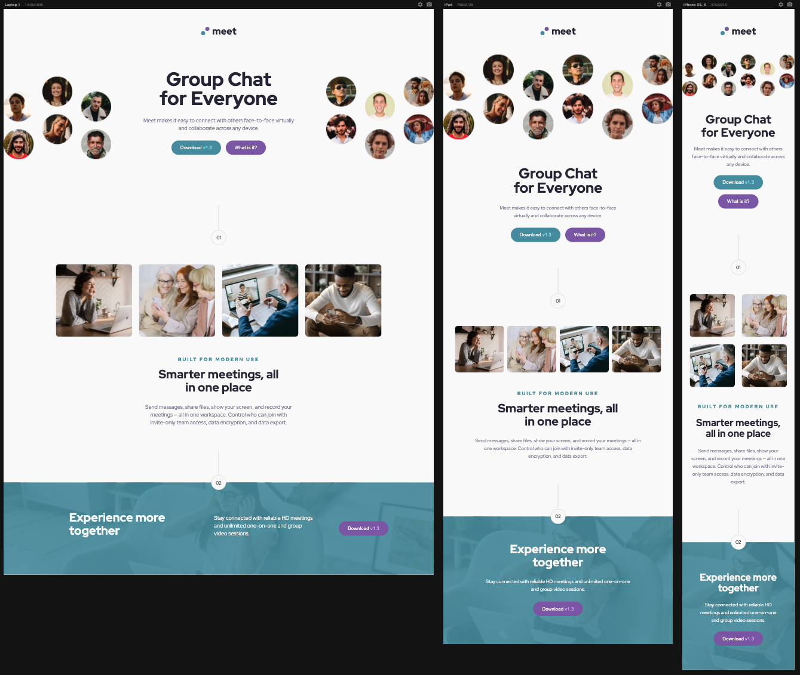

## Table of contents

- [Overview](#overview)
  - [The challenge](#the-challenge)
  - [Screenshot](#screenshot)
  - [Links](#links)
- [My process](#my-process)
  - [Built with](#built-with)
- [Author](#author)

## Overview

### The challenge

Users should be able to:

- View the optimal layout depending on their device's screen size (mobile: 375px, tablet: 768px, desktop: 1440px)
- See hover states for interactive elements

### Screenshot

### Links

[Live Site URL](https://inquisitive-mooncake-804a57.netlify.app/)

## My process

### Built with

- Semantic HTML5 markup
- CSS custom properties
- Flexbox

## Author

- Frontend Mentor - [@estebanp2022](https://www.frontendmentor.io/profile/estebanp2022)
